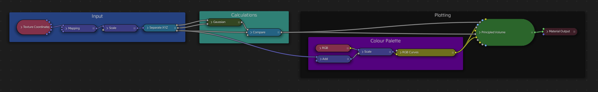
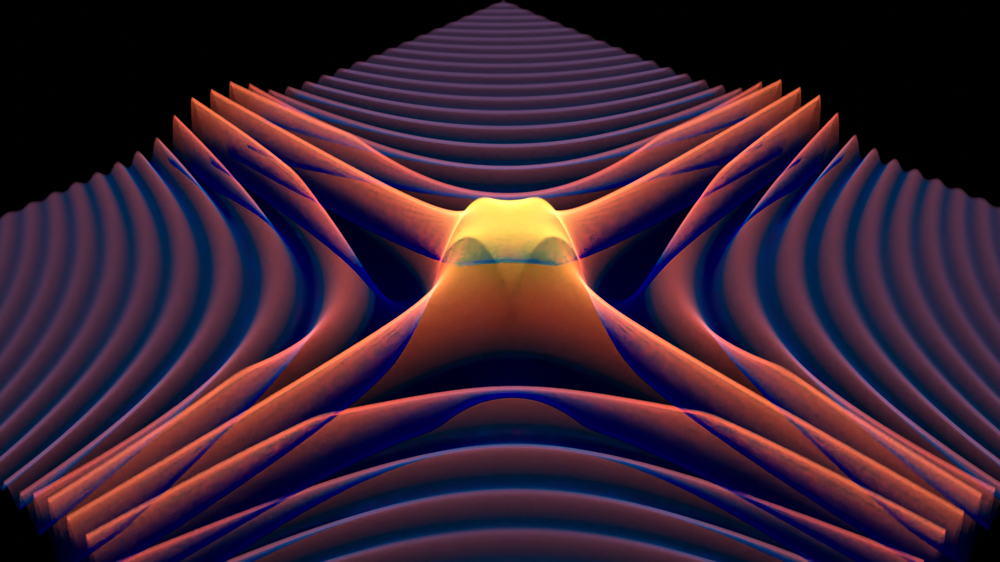
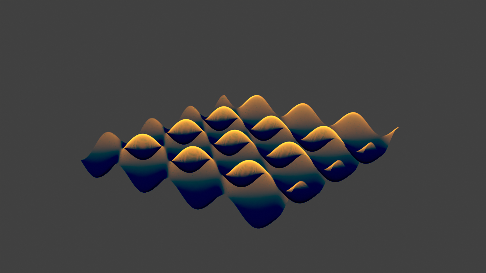

# Bplot

A little 3d function plotting setup using procedural textures in blender.

# Nodes

# Example plots

## Rippling cos

`(1/x^2 + 1/y^2) cos(xy)` (inverses clamped)

## A classic

`cos(x) + sin(y)`

